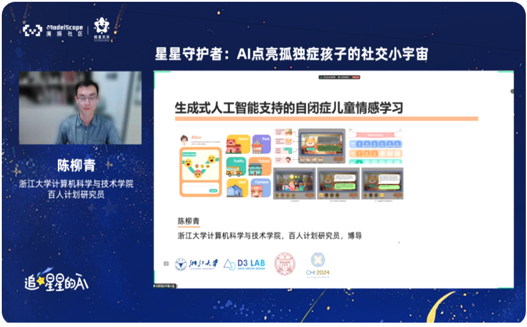
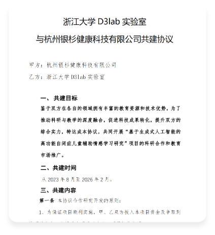

# EmoEden

- 本项目提供了基于生成式人工智能的高功能自闭症儿童情感学习辅助系统，更多信息可以参考我们的[论文](https://dl.acm.org/doi/abs/10.1145/3613904.3642899)

- 已入选ccf技术公益案例集

   

- 受阿里巴巴公益基金会邀请，合作积极宣传生成式AI在辅助自闭症干预方面的作用与成果并开源代码

- 目前已经被用在ASD干预机构投入使用

   

## 大语言模型

- 目前代码中使用[通义千问](https://help.aliyun.com/zh/dashscope/developer-reference/api-details)大模型（`qwen_plus`和`qwen_max`）来生成内容。大模型的配置信息在`./EmoEden/webapp/chat/chat.py`和`./ASD/webapp/chat/prompt.py`文件下，如想使用其他大模型，请在这两个文件夹下自行配置。

## 启动项目

- Python版本：3.7

- 设置API_KEY：进入`./EmoEden/webapp/chat/chat.py`和`./ASD/webapp/chat/prompt.py`，将对应的API KEY改成您的API KEY

- 在`./EmoEden`根目录下命令行运行命令`pip install -r requirements.txt`安装项目依赖

- 在`./EmoEden`根目录下命令行运行命令`python manage.py runserver  `启动项目。

  

## 系统账号

- 请使用以下账号来体验EmoEden

**低功能自闭症**

- 账号：bulubulu
- 密码：20232023bulu

**高功能自闭症**

- 账号：xingabc
- 密码：20232023xing

## 引用

如果您觉得我们的项目对您有帮助，请引用我们的[论文](https://dl.acm.org/doi/abs/10.1145/3613904.3642899)：

    @inproceedings{10.1145/3613904.3642899,
    author = {Tang, Yilin and Chen, Liuqing and Chen, Ziyu and Chen, Wenkai and Cai, Yu and Du, Yao and Yang, Fan and Sun, Lingyun},
    title = {EmoEden: Applying Generative Artificial Intelligence to Emotional Learning for Children with High-Function Autism},
    year = {2024},
    isbn = {9798400703300},
    publisher = {Association for Computing Machinery},
    address = {New York, NY, USA},
    url = {https://doi.org/10.1145/3613904.3642899},
    doi = {10.1145/3613904.3642899},
    booktitle = {Proceedings of the CHI Conference on Human Factors in Computing Systems},
    articleno = {1001},
    numpages = {20},
    location = {<conf-loc>, <city>Honolulu</city>, <state>HI</state>, <country>USA</country>, </conf-loc>},
    series = {CHI '24}
    }
